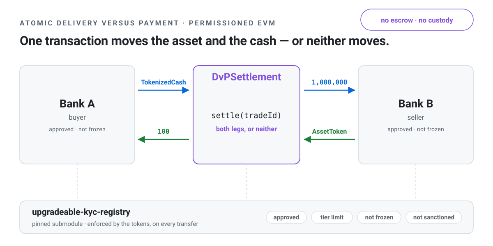
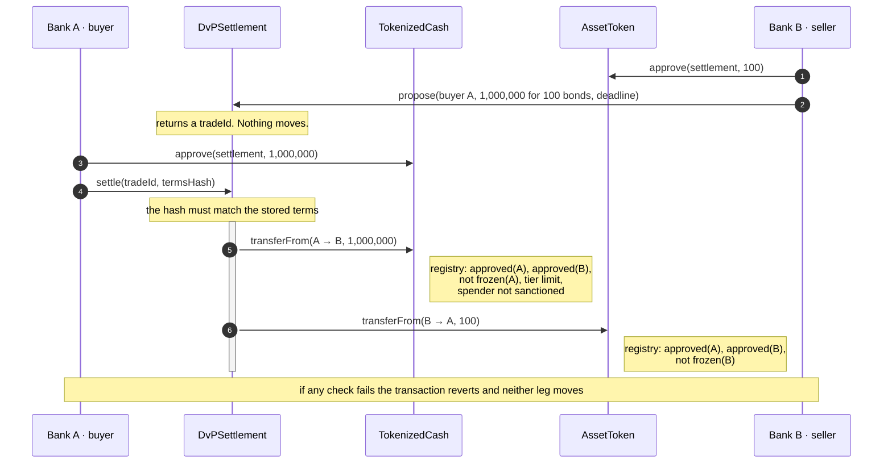

# atomic-settlement

<p align="center">
  <picture>
    <source media="(prefers-color-scheme: dark)" srcset="img/hero-dark.svg">
    
  </picture>
</p>

Delivery-versus-payment settlement for a permissioned EVM network. Three contracts: a
compliance-gated cash token, an asset token, and a settlement contract that moves both
legs in one transaction. Written in Solidity with Foundry; runs on Anvil or on a Besu
network.

Not audited. Don't put real money behind it.

| Contract        | Role                                                               |
| --------------- | ------------------------------------------------------------------ |
| `TokenizedCash` | the cash leg: commercial bank money or a simplified wholesale CBDC |
| `AssetToken`    | the asset leg: a single bond issue                                 |
| `DvPSettlement` | executes both transfers in one transaction, or neither             |

All three read compliance state from
[`upgradeable-kyc-registry`](https://github.com/jaravan/upgradeable-kyc-registry), which
lives in its own repo and is pulled in here as a pinned submodule.

## Why

A trade is two transfers going opposite ways. If they happen in separate transactions,
whoever moves first is exposed until the other side moves. That's settlement risk. Putting
both transfers in one EVM transaction removes it, because the transaction either succeeds
in full or reverts in full.

This is the "integrated settlement" model, where the cash is a token on the same ledger as
the asset. The Swiss National Bank's
[Project Helvetia](https://www.snb.ch/en/the-snb/mandates-goals/payment-transactions/projekt_helvetia)
runs this model with wholesale CBDC on
[SIX Digital Exchange](https://www.six-group.com/en/products-services/securities-services/digital-assets/digital-securities.html).

## Scope

Settlement only. The contracts don't match orders or quote prices. By the time anything
here gets called, two banks have already agreed what they're trading and on what terms,
whether on a venue or over the phone. That's how real markets split it too: trading on a
venue, settlement at a central securities depository. This repo is the depository half.

## The settlement path



Settlement is two calls. The seller records the terms with `propose`, which moves nothing.
The buyer executes with `settle`, passing a hash of the terms it thinks it agreed to. The
contract recomputes the hash from the stored proposal and reverts if they differ. So both
sides have to state the same trade independently, which is roughly what a CSD does when
it matches instructions. The terms are stored on-chain rather than passed in calldata
because an ERC-20 allowance only authorises an amount, not a specific trade (see
[settlement design, section 2](doc/design-settlement.md#2-a-trade-is-agreed-before-it-settles)).

Two consequences of the compliance rules in the tokens:

- **The settlement contract never holds anything.** A transfer recipient has to be approved
  in the registry, and a contract can't be. So cash goes straight from buyer to seller and
  the bond straight from seller to buyer.
- **The tokens do the compliance checks, not the settlement contract.** `settle` just calls
  `transferFrom`; each token checks the registry itself. `DvPSettlement` makes no registry
  calls at all.

## Documentation

- [Design](doc/DESIGN.md): scope, the DvP mechanism, how the three contracts fit together
- [Tokenized Cash](doc/design-cash.md): the cash leg
- [Asset Token](doc/design-asset.md): the asset leg
- [Settlement](doc/design-settlement.md): the settlement contract
- [Integration notes](doc/integration.md): things a client has to get right that the
  contracts can't enforce

## Build and test

You need [Foundry](https://book.getfoundry.sh/getting-started/installation). The Foundry
project root is `src/`, so run everything from there.

```sh
git clone --recurse-submodules https://github.com/jaravan/atomic-settlement
cd atomic-settlement/src

forge build
forge test                                   # 338 tests, about a second
forge test --match-path test/Gas.t.sol -vv   # the measurements behind each Gas section
forge coverage --no-match-coverage "test|script"

FOUNDRY_PROFILE=deep forge test --match-contract SystemInvariants   # 128,000 calls per invariant, ~45s

slither .                                    # static analysis; config and triage in slither.config.json
```

CI runs `forge fmt --check`, `forge build`, `forge test` and Slither on every push. The
Slither config excludes four detectors that fire on intended behaviour; the reasons are in
[`.github/workflows/test.yml`](.github/workflows/test.yml).

Compiler and EVM version are pinned in [`foundry.toml`](src/foundry.toml): solc 0.8.30,
EVM version London. Nothing here needs a later fork, and London is the newest fork the Besu
chart below can enable.

## Run it locally

**1. A chain.** Anvil comes with Foundry:

```sh
anvil
```

**2. Deploy.** [`DeployLocal.s.sol`](src/script/DeployLocal.s.sol) deploys the registry
behind a proxy, both tokens and the settlement contract, then onboards and funds two banks.
Every key is an Anvil default, so don't point it at anything that holds value.

```sh
export RPC=http://localhost:8545
export DEPLOYER=0xac0974bec39a17e36ba4a6b4d238ff944bacb478cbed5efcae784d7bf4f2ff80   # anvil account 0

forge script script/DeployLocal.s.sol:DeployLocal --rpc-url $RPC --private-key $DEPLOYER --broadcast
```

It prints the four addresses. Export them:

```sh
export CASH=0x…   BOND=0x…   DVP=0x…
export BANK_A=0x70997970C51812dc3A010C7d01b50e0d17dc79C8   A_KEY=0x59c6995e998f97a5a0044966f0945389dc9e86dae88c7a8412f4603b6b78690d
export BANK_B=0x3C44CdDdB6a900fa2b585dd299e03d12FA4293BC   B_KEY=0x5de4111afa1a4b94908f83103eb1f1706367c2e68ca870fc3fb9a804cdab365a
```

**3. Bank B sells 100 bonds to Bank A for EUR 10m.** The seller approves and proposes:

```sh
DEADLINE=$(( $(cast block latest -f timestamp --rpc-url $RPC) + 86400 ))

cast send $BOND "approve(address,uint256)" $DVP 100 --rpc-url $RPC --private-key $B_KEY
cast send $DVP "propose((address,address,bytes3,uint256,address,bytes12,uint256,uint64))" \
  "($BANK_A,$CASH,0x455552,10000000000000,$BOND,0x444530303041314557575730,100,$DEADLINE)" \
  --rpc-url $RPC --private-key $B_KEY
# tradeId is topic[1] of the TradeProposed log; the first proposal is 1
```

**4. Bank A computes the terms hash from its own record.** Don't read the proposal back and
hash that — see [integration notes, section 4](doc/integration.md#4-the-terms-hash).

```sh
HASH=$(cast keccak $(cast abi-encode \
  "f(uint256,address,uint256,address,address,address,bytes3,uint256,address,bytes12,uint256,uint64)" \
  $(cast chain-id --rpc-url $RPC) $DVP 1 $BANK_B $BANK_A \
  $CASH 0x455552 10000000000000 $BOND 0x444530303041314557575730 100 $DEADLINE))
```

**5. Preview, approve, settle:**

```sh
cast call $DVP "canSettle(uint256,bytes32)(bool,bytes4)" 1 $HASH --rpc-url $RPC
# false, 0xfb8f41b2 — ERC20InsufficientAllowance: Bank A hasn't approved the cash yet

cast send $CASH "approve(address,uint256)" $DVP 10000000000000 --rpc-url $RPC --private-key $A_KEY
cast send $DVP "settle(uint256,bytes32)" 1 $HASH --rpc-url $RPC --private-key $A_KEY

cast call $BOND "balanceOf(address)(uint256)" $BANK_A --rpc-url $RPC   # 100
cast call $CASH "balanceOf(address)(uint256)" $BANK_B --rpc-url $RPC   # 10000000000000
```

Both legs moved in one transaction. Calling `settle` again with a different `HASH` reverts
with `TermsMismatch` before anything moves.

## Run it on Besu

[`besu-helmcharts`](https://github.com/jaravan/besu-helmcharts) stands up a four-validator
QBFT network on Kubernetes with free gas and a single RPC endpoint:

```sh
helm upgrade --install sbx oci://ghcr.io/jaravan/besu-helmcharts/besu-sandbox \
  -n besu --create-namespace --wait --timeout=600s
kubectl -n besu port-forward svc/sbx-rpc-unified 8545:8545
```

Then follow the same steps with `RPC=http://localhost:8545` and the chart's pre-funded dev
keys instead of Anvil's. The chart's genesis is pre-London by default; set
`genesis.london: true` in its values.

For a real deployment use the three per-contract scripts instead of `DeployLocal`:

| Script                                                        | Reads from the environment                                | Refuses                                                      |
| ------------------------------------------------------------- | --------------------------------------------------------- | ------------------------------------------------------------ |
| [`DeployCash.s.sol`](src/script/DeployCash.s.sol)             | token name, symbol, currency; registry; four role holders | issuer = compliance officer; a registry address with no code |
| [`DeployAsset.s.sol`](src/script/DeployAsset.s.sol)           | as above, with an ISIN                                    | the same, plus a bad ISIN check digit                        |
| [`DeploySettlement.s.sol`](src/script/DeploySettlement.s.sol) | nothing; it has no configuration and no roles             |                                                              |

Each is `forge script script/<name>:<Contract> --rpc-url … --private-key … --broadcast`.

## License

[Apache 2.0](LICENSE)
