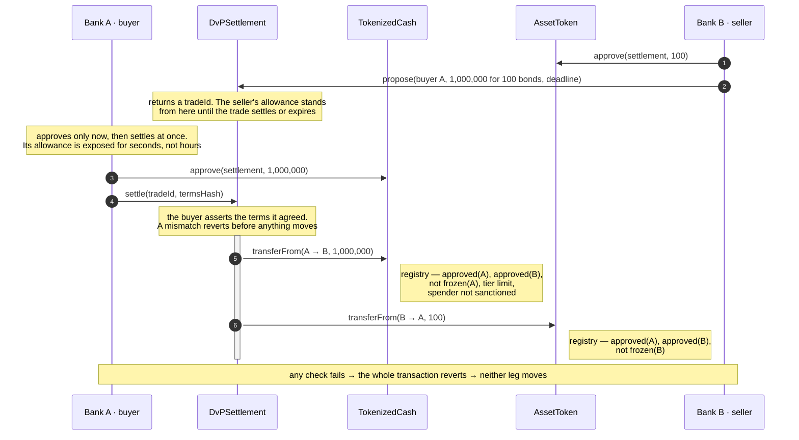

# atomic-settlement

  <picture>
    <source media="(prefers-color-scheme: dark)" srcset="img/hero-dark.svg">
    
  </picture>

Atomic DvP settlement on permissioned EVM networks — compliance-gated tokenized cash, an
asset leg, and the settlement contract that moves both or neither. Solidity, Foundry, Besu.

| Contract        | Role                                                                      |
| --------------- | ------------------------------------------------------------------------- |
| `TokenizedCash` | the cash leg; could represent commercial bank money, or a simplified CBDC |
| `AssetToken`    | the asset leg; a simplified security, standing in for the issuer's own    |
| `DvPSettlement` | moves both legs in one transaction, or neither                            |

All three read compliance state from
[`upgradeable-kyc-registry`](https://github.com/jaravan/upgradeable-kyc-registry), a
separate repository consumed as a pinned submodule.

## Why

Every trade is two transfers in opposite directions, and they do not naturally happen at
the same instant. Whoever moves first is exposed until the other side moves — **settlement
risk**. Tie the two transfers to one transaction and the gap disappears: an EVM transaction
either fully succeeds or fully reverts, so _at the same time_ is free.

This is the model the Swiss National Bank calls **integrated settlement** — money as a
token on the same ledger as the asset — and the one [Project Helvetia](https://www.snb.ch/en/the-snb/mandates-goals/payment-transactions/projekt_helvetia)
pilots with wholesale CBDC on [SIX Digital Exchange](https://www.six-group.com/en/products-services/securities-services/digital-assets/digital-securities.html).

## Trading happens elsewhere

This repository settles trades. It does not find counterparties, quote prices, or match
orders. By the time anything here runs, two banks have already agreed what they are
trading and on what terms.

A bond purchase, in full:

1. **Bank A wants bonds.** It asks for a quote — Bloomberg, Tradeweb, or a phone call.
   The buyer initiates.
2. **Bank B quotes, and they agree price and size.** The trade now exists between them.
   Nothing has touched the chain.
3. **Settlement begins.** Bank B records the agreed terms with `propose`; Bank A executes
   them with `settle`.

Real markets split these the same way: you trade on a venue, you settle at a central
securities depository — Euroclear, T2S, DTCC. **This repository is the depository half.**
`propose` is a settlement instruction for a trade that already exists, not an offer
looking for a taker.

## The settlement path

**Settling takes two calls, not one, and only the second moves value.** The seller
proposes the terms; the buyer's `settle` asserts the terms it agreed and is both the
acceptance and the execution, the call that does both transfers or neither. Neither side's
version of the trade is authoritative alone, which is how a CSD matches instructions. The
terms have to be recorded on-chain first because an allowance authorises an amount, not a
trade
([settlement section 2](doc/design-settlement.md#2-a-trade-is-agreed-before-it-settles)).
The direction is fixed, and [settlement section 3](doc/design-settlement.md#3-lifecycle)
gives the reason.

Two further properties fall out of this shape, and both are requirements rather than
preferences:

- **The settlement contract never takes custody.** An escrowing contract would have to be
  the `to` of a transfer, and `to` must be `isApproved` — which a contract can never be.
  Cash moves directly from buyer to seller, and the bond from seller to buyer.
- **Compliance is enforced by the tokens, not by the settlement contract.** `settle()`
  calls `transferFrom` and the token reads the registry itself, so the checks happen at
  settlement time and there is only ever one source of truth.

## Design notes

- [Design](doc/DESIGN.md) — scope, the DvP mechanism, how the three contracts fit together
- [Tokenized Cash](doc/design-cash.md) — the cash leg, in full
- [Asset Token](doc/design-asset.md) — the asset leg, in full
- [Settlement](doc/design-settlement.md) — the settlement contract, in full

## Status

Design first: the reasoning is written down before the Solidity is. Contracts land in
`src/` behind the documents above.

## License

[Apache 2.0](LICENSE)
