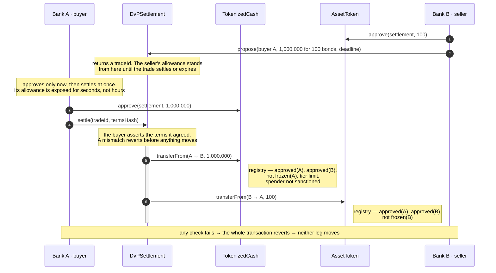

# atomic-settlement

<p align="center">
  <picture>
    <source media="(prefers-color-scheme: dark)" srcset="img/hero-dark.svg">
    
  </picture>
</p>

Atomic DvP settlement on permissioned EVM networks — compliance-gated tokenized cash, an
asset leg, and the settlement contract that moves both or neither. Solidity, Foundry, Besu.

| Contract        | Role                                                                      |
| --------------- | ------------------------------------------------------------------------- |
| `TokenizedCash` | the cash leg; could represent commercial bank money, or a simplified CBDC |
| `AssetToken`    | the asset leg; a simplified security, standing in for the issuer's own    |
| `DvPSettlement` | moves both legs in one transaction, or neither                            |

All three read compliance state from
[`upgradeable-kyc-registry`](https://github.com/jaravan/upgradeable-kyc-registry), a
separate repository consumed as a pinned submodule.

## Why

Every trade is two transfers in opposite directions, and they do not naturally happen at
the same instant. Whoever moves first is exposed until the other side moves — **settlement
risk**. Tie the two transfers to one transaction and the gap disappears: an EVM transaction
either fully succeeds or fully reverts, so _at the same time_ is free.

This is the model the Swiss National Bank calls **integrated settlement** — money as a
token on the same ledger as the asset — and the one [Project Helvetia](https://www.snb.ch/en/the-snb/mandates-goals/payment-transactions/projekt_helvetia)
pilots with wholesale CBDC on [SIX Digital Exchange](https://www.six-group.com/en/products-services/securities-services/digital-assets/digital-securities.html).

## Trading happens elsewhere

This repository settles trades. It does not find counterparties, quote prices, or match
orders. By the time anything here runs, two banks have already agreed what they are
trading and on what terms.

A bond purchase, in full:

1. **Bank A wants bonds.** It asks for a quote — Bloomberg, Tradeweb, or a phone call.
   The buyer initiates.
2. **Bank B quotes, and they agree price and size.** The trade now exists between them.
   Nothing has touched the chain.
3. **Settlement begins.** Bank B records the agreed terms with `propose`; Bank A executes
   them with `settle`.

Real markets split these the same way: you trade on a venue, you settle at a central
securities depository — Euroclear, T2S, DTCC. **This repository is the depository half.**
`propose` is a settlement instruction for a trade that already exists, not an offer
looking for a taker.

## The settlement path



**Settling takes two calls, not one, and only the second moves value.** The seller
proposes the terms; the buyer's `settle` asserts the terms it agreed and is both the
acceptance and the execution, the call that does both transfers or neither. Neither side's
version of the trade is authoritative alone, which is how a CSD matches instructions. The
terms have to be recorded on-chain first because an allowance authorises an amount, not a
trade
([settlement section 2](doc/design-settlement.md#2-a-trade-is-agreed-before-it-settles)).
The direction is fixed, and [settlement section 3](doc/design-settlement.md#3-lifecycle)
gives the reason.

Two further properties fall out of this shape, and both are requirements rather than
preferences:

- **The settlement contract never takes custody.** An escrowing contract would have to be
  the `to` of a transfer, and `to` must be `isApproved` — which a contract can never be.
  Cash moves directly from buyer to seller, and the bond from seller to buyer.
- **Compliance is enforced by the tokens, not by the settlement contract.** `settle()`
  calls `transferFrom` and the token reads the registry itself, so the checks happen at
  settlement time and there is only ever one source of truth.

## Design notes

- [Design](doc/DESIGN.md) — scope, the DvP mechanism, how the three contracts fit together
- [Tokenized Cash](doc/design-cash.md) — the cash leg, in full
- [Asset Token](doc/design-asset.md) — the asset leg, in full
- [Settlement](doc/design-settlement.md) — the settlement contract, in full
- [Integration notes](doc/integration.md) — what a client has to get right that the
  contracts cannot enforce

## Status

All three contracts are built, each one design section at a time, with its tests landing
in the same commit. Every branch is covered, every `Gas` section is measured, and each
contract has an integration suite against the real registry.

| Contract        | Lines | Tests | Branch coverage |
| --------------- | ----: | ----: | --------------: |
| `TokenizedCash` |   396 |   107 |            100% |
| `AssetToken`    |   303 |    92 |            100% |
| `DvPSettlement` |   343 |    80 |            100% |

Not yet done: fuzz and invariant tests across the whole system.

## Build and test

Requires [Foundry](https://book.getfoundry.sh/getting-started/installation). The Foundry
project root is `src/`; every command below runs from there.

```sh
git clone --recurse-submodules https://github.com/jaravan/atomic-settlement
cd atomic-settlement/src

forge build
forge test                                   # 319 tests
forge test --match-path test/Gas.t.sol -vv   # the measurements behind each Gas section
forge coverage --no-match-coverage "test|script"
```

The compiler and EVM version are pinned in [`foundry.toml`](src/foundry.toml): solc 0.8.30,
**Cancun**. `AssetToken` uses transient storage, so the target chain must be Cancun too.

## Run it locally

A dev chain, the whole system, and one settlement — five minutes.

**1. A Cancun chain.** Anvil ships with Foundry:

```sh
anvil --hardfork cancun
```

**2. Stand everything up.** [`DeployLocal.s.sol`](src/script/DeployLocal.s.sol) deploys the
registry behind a proxy, both legs, the settlement contract, onboards two banks and funds
them. Every key is an Anvil default. Never point it at a network that holds value.

```sh
export RPC=http://localhost:8545
export DEPLOYER=0xac0974bec39a17e36ba4a6b4d238ff944bacb478cbed5efcae784d7bf4f2ff80   # anvil account 0

forge script script/DeployLocal.s.sol:DeployLocal --rpc-url $RPC --private-key $DEPLOYER --broadcast
```

It prints the four addresses. Export them:

```sh
export CASH=0x…   BOND=0x…   DVP=0x…
export BANK_A=0x70997970C51812dc3A010C7d01b50e0d17dc79C8   A_KEY=0x59c6995e998f97a5a0044966f0945389dc9e86dae88c7a8412f4603b6b78690d
export BANK_B=0x3C44CdDdB6a900fa2b585dd299e03d12FA4293BC   B_KEY=0x5de4111afa1a4b94908f83103eb1f1706367c2e68ca870fc3fb9a804cdab365a
```

**3. Bank B sells 100 bonds to Bank A for EUR 10m.** The seller approves and proposes:

```sh
DEADLINE=$(( $(cast block latest -f timestamp --rpc-url $RPC) + 86400 ))

cast send $BOND "approve(address,uint256)" $DVP 100 --rpc-url $RPC --private-key $B_KEY
cast send $DVP "propose((address,address,bytes3,uint256,address,bytes12,uint256,uint64))" \
  "($BANK_A,$CASH,0x455552,10000000000000,$BOND,0x444530303041314557575730,100,$DEADLINE)" \
  --rpc-url $RPC --private-key $B_KEY
# tradeId is topic[1] of the TradeProposed log; the first proposal is 1
```

**4. Bank A computes the terms hash from its own record** — not by reading the proposal
back ([integration notes §4](doc/integration.md#4-the-terms-hash)):

```sh
HASH=$(cast keccak $(cast abi-encode \
  "f(uint256,address,uint256,address,address,address,bytes3,uint256,address,bytes12,uint256,uint64)" \
  $(cast chain-id --rpc-url $RPC) $DVP 1 $BANK_B $BANK_A \
  $CASH 0x455552 10000000000000 $BOND 0x444530303041314557575730 100 $DEADLINE))
```

**5. Preview, approve, settle:**

```sh
cast call $DVP "canSettle(uint256,bytes32)(bool,bytes4)" 1 $HASH --rpc-url $RPC
# false, 0xfb8f41b2 — ERC20InsufficientAllowance: Bank A has not approved the cash yet

cast send $CASH "approve(address,uint256)" $DVP 10000000000000 --rpc-url $RPC --private-key $A_KEY
cast send $DVP "settle(uint256,bytes32)" 1 $HASH --rpc-url $RPC --private-key $A_KEY

cast call $BOND "balanceOf(address)(uint256)" $BANK_A --rpc-url $RPC   # 100
cast call $CASH "balanceOf(address)(uint256)" $BANK_B --rpc-url $RPC   # 10000000000000
```

Both legs moved in one transaction. Try it again with a different `HASH` and watch
`settle` revert with `TermsMismatch` before anything moves.

## Run it on Besu

[`besu-helmcharts`](https://github.com/jaravan/besu-helmcharts) stands up a four-validator
QBFT network on Kubernetes with free gas and a unified RPC endpoint:

```sh
helm upgrade --install sbx oci://ghcr.io/jaravan/besu-helmcharts/besu-sandbox \
  -n besu --create-namespace --wait --timeout=600s
kubectl -n besu port-forward svc/sbx-rpc-unified 8545:8545
```

Then the steps above with `RPC=http://localhost:8545` and the chart's pre-funded dev keys
in place of Anvil's.

**One requirement the chart does not meet today.** Its genesis is pre-London with a London
toggle; these contracts need **Cancun**. Deploying `AssetToken` to it fails with an invalid
opcode. The genesis needs `londonBlock: 0`, `shanghaiTime: 0` and `cancunTime: 0` — a
change to the chart, tracked there, not something this repository can work around.

For a real deployment use the three per-contract scripts, not `DeployLocal`:

| Script | Reads from the environment | Refuses |
| --- | --- | --- |
| [`DeployCash.s.sol`](src/script/DeployCash.s.sol) | token name, symbol, currency; registry; four role holders | issuer = compliance officer; a registry with no code |
| [`DeployAsset.s.sol`](src/script/DeployAsset.s.sol) | as above, with an ISIN | the same, plus a bad ISIN check digit |
| [`DeploySettlement.s.sol`](src/script/DeploySettlement.s.sol) | nothing — it has no configuration and no roles | — |

Each is `forge script script/<name>:<Contract> --rpc-url … --private-key … --broadcast`.

## License

[Apache 2.0](LICENSE)
